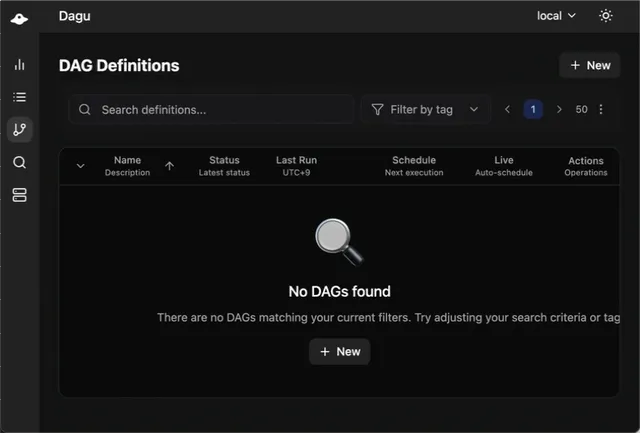

<div align="center">
  
  
  <h3>A lightweight and powerful workflow engine for enterprise & small teams</h3>
  <p>Deployable on-premise, in the cloud, or on IoT devices. Low-code declarative workflow definitions that anyone can understand.</p>
  
  <p>
    <a href="https://docs.dagu.cloud/reference/changelog"></a>
    <a href="https://github.com/dagu-org/dagu/actions/workflows/ci.yaml"></a>
    <a href="https://discord.gg/gpahPUjGRk"></a>
    <a href="https://bsky.app/profile/dagu-org.bsky.social"></a>
  </p>
  
  <p>
    <a href="https://docs.dagu.cloud">Docs</a> |
    <a href="#quick-start">Quick Start</a> |
    <a href="#features">Features</a> |
    <a href="#installation">Installation</a>
  </p>
</div>


# Overview - Orchestrate workflows without complexity

**Dagu** */dah-goo/* is a powerful workflow engine designed to be deployable in environments where Airflow cannot be installed, such as small devices, on-premise servers, and legacy systems. It allows you to declaratively define any batch job as a single DAG (Directed Acyclic Graph) in a simple YAML format.

```yaml
steps:
  - name: step1
    command: sleep 1 && echo "Hello, Dagu!"
    
  - name: step2
    command: sleep 1 && echo "This is a second step"
```

By declaratively defining the processes within a job, complex workflows become visualized, making troubleshooting and recovery easier. Viewing log and retry can be performed from the Web UI, eliminating the need to manually log into a server via SSH.

It is equipped with many features to meet the highly detailed requirements of enterprise environments. It operates even in environments without internet access and, being statically compiled, includes all dependencies, allowing it to be used in any environment, including on-premise, cloud, and IoT devices. It is a lightweight workflow engine that meets enterprise requirements.

Note: For a list of features, please refer to the [documentation](https://docs.dagu.cloud/features/).

Workflow jobs are defined as commands. Therefore, legacy scripts that have been in operation for a long time within a company or organization can be used as-is without modification. There is no need to learn a complex new language, and you can start using it right away.

Dagu is designed for small teams of 1-3 people to easily manage complex workflows. It aims to be an ideal choice for teams that find large-scale, high-cost infrastructure like Airflow to be overkill and are looking for a simpler solution. It requires no database management and only needs a shared filesystem, allowing you to focus on your high-value work.

## Demo

**CLI Demo**: Create a simple DAG workflow and execute it using the command line interface.


**Web UI Demo**: Create and manage workflows using the web interface, including real-time monitoring and control.

[Docs on CLI](https://docs.dagu.cloud/overview/cli)



[Docs on Web UI](https://docs.dagu.cloud/overview/web-ui)

## Recent Updates

### v1.19 - upcoming
- **DAG-level Container Support**: Define container images for entire DAGs, allowing all steps to run in a specified container for reproducibility

### v1.18 - 2025-07-29
- **OpenID Connect (OIDC) Support**: OpenID Connect authentication for secure access ([@Arvintian](https://github.com/Arvintian))
- **Distributed Execution**: Run steps across multiple machines with worker processes
- **High Availability**: Redundant scheduler instances with automatic failover
- **Step-level Environment Variables**: Define environment variables specific to individual steps ([@admerzeau](https://github.com/admerzeau))
- **Scheduler Health Check**: HTTP health check endpoint for monitoring (default: `http://localhost:8090/health`) - automatically enabled with `dagu scheduler` ([@jonasban](https://github.com/jonasban))
- **Enhanced Repeat Policy**: Explicit `until` and `while` modes for clearer repeat logic ([@thefishhat](https://github.com/thefishhat))
- **Exponential Backoff**: Added exponential backoff support for retry policies ([@Sarvesh-11](https://github.com/Sarvesh-11))
- **Live Log Loading**: Real-time log streaming in the Web UI ([@tapir](https://github.com/tapir))
- **Partial Success Status**: Step-level partial success for sub-DAG executions ([@ghansham](https://github.com/ghansham))
- **Multiple Email Recipients**: Support for multiple recipients in email notifications
- **UI Improvements**: Manual sidebar toggle, better DAG sorting, and various enhancements ([@ghansham](https://github.com/ghansham))

### v1.17 - 2025-06-18
- **OpenTelemetry Support (OTEL)**: Distributed tracing with W3C trace context propagation (requested by [@jeremydelattre59](https://github.com/jeremydelattre59))
- **Windows Support (Beta)**: Initial PowerShell and cmd.exe compatibility - basic functionality works but may have limitations ([@pdoronila](https://github.com/pdoronila))
- **Hierarchical DAG**: Nested workflows with parameter passing
- **Individual Step Retry**: Retry individual steps without re-running entire workflow ([@thefishhat](https://github.com/thefishhat))
- **Repeat Policy Enhancement**: The 'while'/'until' modes are added to repeat policy setting ([@thefishhat](https://github.com/thefishhat))
- **Queueing functionality**: Enqueue DAGs without running immediately to limit resource usage of the workflow ([@kriyanshii](https://github.com/kriyanshii))

[Full changelog](https://docs.dagu.cloud/reference/changelog)

## Use Cases

Dagu is designed to orchestrate workflows across various domains, particularly those involving multi-step batch jobs and complex data dependencies. Example applications include:

* AI/ML & Data Science - Automating machine learning workflows, including data ingestion, feature engineering, model training, validation, and deployment.
* Geospatial & Environmental Analysis - Processing datasets from sources such as satellites (earth observation), aerial/terrestrial sensors, seismic surveys, and ground-based radar. Common uses include numerical weather prediction and natural resource management.
* Finance & Trading - Implementing time-sensitive workflows for stock market analysis, quantitative modeling, risk assessment, and report generation.
* Medical Imaging & Bioinformatics - Creating pipelines to process and analyze large volumes of medical scans (e.g., MRI, CT) or genomic data for clinical and research purposes.
* Data Engineering (ETL/ELT) - Building, scheduling, and monitoring pipelines for moving and transforming data between systems like databases, data warehouses, and data lakes.
* IoT & Edge Computing - Orchestrating workflows that collect, process, and analyze data from distributed IoT devices, sensors, and edge nodes.
* Media & Content Processing - Automating workflows for video transcoding, image processing, and content delivery, including tasks like format conversion, compression, and metadata extraction.

## Features

- [DAG definition](https://docs.dagu.cloud/writing-workflows/examples/) - Express complex dependencies in readable YAML
- [Scheduling](https://docs.dagu.cloud/features/scheduling) - Cron expressions with timezone support
- [Queueing](https://docs.dagu.cloud/features/queues) - Control concurrency with named queues
- [Error handling](https://docs.dagu.cloud/writing-workflows/error-handling) - Retries, failure handlers, cleanup hooks
- [Conditional execution](https://docs.dagu.cloud/writing-workflows/control-flow) - Run steps based on conditions
- [Parallel execution](https://docs.dagu.cloud/features/parallel-execution) - Control concurrent step execution
- [Variables & Parameters](https://docs.dagu.cloud/writing-workflows/data-variables) - Pass data between steps, parameterize workflows
- [Docker support](https://docs.dagu.cloud/features/executors/docker) - Run steps in containers
- [SSH executor](https://docs.dagu.cloud/features/executors/ssh) - Execute commands on remote hosts
- [HTTP requests](https://docs.dagu.cloud/features/executors/http) - Integrate with APIs
- [Email notifications](https://docs.dagu.cloud/features/email-notifications) - SMTP integration
- [Hierarchical workflows](https://docs.dagu.cloud/writing-workflows/advanced#hierarchical-workflows) - Nest DAGs to any depth
- [Distributed execution](https://docs.dagu.cloud/features/distributed-execution) - Scale across multiple machines
- [Authentication](https://docs.dagu.cloud/features/authentication) - Basic auth, API tokens, TLS
- [Web UI](https://docs.dagu.cloud/overview/web-ui) - Real-time monitoring and control
- [REST API](https://docs.dagu.cloud/overview/api) - Full programmatic access

## Quick Start

```bash
# Install via npm
npm install -g dagu

# Create your first workflow
mkdir -p ~/.config/dagu/dags
cat > ~/.config/dagu/dags/hello.yaml << 'EOF'
steps:
  - name: hello
    command: echo "Hello from Dagu!"
    
  - name: world  
    command: echo "Running step 2"
EOF

# Execute it
dagu start hello

# Check the status
dagu status hello

# Start the web UI
dagu start-all
# Visit http://localhost:8080
```

## Installation

### npm

```bash
# Install globally
npm install -g dagu
```

The npm package includes pre-built binaries for all major platforms.

### Installer Script

```bash
# Latest via installer script
curl -L https://raw.githubusercontent.com/dagu-org/dagu/main/scripts/installer.sh | bash

# Specific version
curl -L https://raw.githubusercontent.com/dagu-org/dagu/main/scripts/installer.sh | bash -s -- --version v1.17.0

# Install to a specific directory
curl -L https://raw.githubusercontent.com/dagu-org/dagu/main/scripts/installer.sh | bash -s -- --prefix /path/to/install
```

### Homebrew

```
# Install
brew install dagu-org/brew/dagu

# Upgrade
brew upgrade dagu-org/brew/dagu
```

### Docker
```bash
docker run -d \
  --name dagu \
  -p 8080:8080 \
  -v ~/.dagu:/var/lib/dagu \
  ghcr.io/dagu-org/dagu:latest dagu start-all
```

### Manual Download
Download from [releases](https://github.com/dagu-org/dagu/releases) and add to PATH.

## Documentation

- [Getting Started](https://docs.dagu.cloud/getting-started/quickstart) - Tutorial and first steps
- [Core Concepts](https://docs.dagu.cloud/getting-started/concepts) - Architecture and design
- [Writing Workflows](https://docs.dagu.cloud/writing-workflows/) - Complete authoring guide
- [CLI Reference](https://docs.dagu.cloud/reference/cli) - Command-line usage
- [API Reference](https://docs.dagu.cloud/reference/api) - REST API documentation
- [Configuration](https://docs.dagu.cloud/configurations/server) - Configuration options
- [Changelog](https://docs.dagu.cloud/reference/changelog) - Release notes and version history

## Examples

Find more in our [examples documentation](https://docs.dagu.cloud/writing-workflows/examples/).

### ETL Pipeline
```yaml
name: daily-etl
schedule: "0 2 * * *"
steps:
  - name: extract
    command: python extract.py
    output: DATA_FILE
    
  - name: validate
    command: python validate.py ${DATA_FILE}
    
  - name: transform
    command: python transform.py ${DATA_FILE}
    retryPolicy:
      limit: 3
      
  - name: load
    command: python load.py ${DATA_FILE}
```

### Hierarchical Workflows
```yaml
steps:
  - name: data-pipeline
    run: etl
    params: "ENV=prod REGION=us-west-2"
    
  - name: parallel-jobs
    run: batch
    parallel:
      items: ["job1", "job2", "job3"]
      maxConcurrency: 2
    params: "JOB=${ITEM}"
---
name: etl
params:
  - ENV
  - REGION
steps:
  - name: process
    command: python etl.py --env ${ENV} --region ${REGION}
---
name: batch
params:
  - JOB
steps:
  - name: process
    command: python process.py --job ${JOB}
```

### Container-based Pipeline
```yaml
name: ml-pipeline
steps:
  - name: prepare-data
    executor:
      type: docker
      config:
        image: python:3.11
        autoRemove: true
        volumes:
          - /data:/data
    command: python prepare.py
    
  - name: train-model
    executor:
      type: docker
      config:
        image: tensorflow/tensorflow:latest-gpu
    command: python train.py
    
  - name: deploy
    command: kubectl apply -f model-deployment.yaml
    preconditions:
      - condition: "`date +%u`"
        expected: "re:[1-5]"  # Weekdays only
```

### Distributed Execution
```yaml
name: distributed-workflow
steps:
  - name: gpu-training
    run: gpu-training
    params: "REGION=${ITEM}"
    parallel: ["us-east-1", "eu-west-1"]
    
---
name: gpu-training
params: "REGION=region"
workerSelector:
  gpu: "true"
steps:
  - name: gpu-training
    command: python train_model.py ${REGION}
```

## Building from Source

Prerequisites: Go 1.24+, Node.js, pnpm

```bash
git clone https://github.com/dagu-org/dagu.git && cd dagu
make build
make run
```

## Acknowledgements

- [@Arvintian](https://github.com/Arvintian) for implementing OpenID Connect (OIDC) support and HTTP executor
- [@kriyanshii](https://github.com/kriyanshii) for implementing the queueing functionality
- [@pdoronila](https://github.com/pdoronila) for adding Windows support
- [@thefishhat](https://github.com/thefishhat) for various improvements on the scheduler, retry policy, and more
- [@arky](https://github.com/arky) for managing and improving the community, documentation, and examples
- [@ghansham](https://github.com/ghansham) for providing valuable feedback and suggestions

## Contributing

Any contributions are welcome! If you have ideas, suggestions, or improvements, please open an issue or submit a pull request.

- [Discord Community](https://discord.gg/gpahPUjGRk)
- [GitHub Issues](https://github.com/dagu-org/dagu/issues)

## Contributors

<a href="https://github.com/dagu-org/dagu/graphs/contributors">
  
</a>

## Sponsors & Supporters

<a href="https://github.com/Arvintian"></a>
<a href="https://github.com/yurivish"></a>

Thanks for supporting Dagu’s development! Join our supporters: [GitHub Sponsors](https://github.com/sponsors/dagu-org)

## License

GNU GPLv3 - See [LICENSE](./LICENSE)

---

<div align="center">
  <p>If you find Dagu useful, please ⭐ star this repository</p>
</div>
